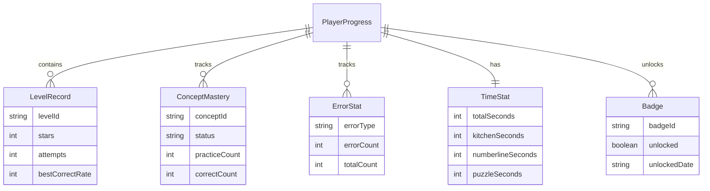

# 分数大冒险 · 技术架构文档

## 1. 架构设计
纯前端单页应用（SPA），无后端服务，所有进度与统计数据持久化在浏览器 `localStorage`。语音提示使用浏览器原生 Web Speech API（`SpeechSynthesis`）。

```mermaid
flowchart TD
    subgraph "前端应用层 React SPA"
        "路由/视图层 React Router"
        "页面组件 关卡选择/厨房/数轴/拼图/奖励/家长"
        "通用机制 语音/拖拽/星级/重试"
    end
    subgraph "领域逻辑层"
        "关卡配置 Config"
        "分数运算引擎 fraction.ts"
        "评分与统计引擎 scoring.ts"
    end
    subgraph "数据持久化层"
        "storage.ts localStorage 封装"
        "游戏进度 Progress"
        "家长统计 Stats"
    end
    "页面组件" --> "通用机制"
    "页面组件" --> "领域逻辑层"
    "领域逻辑层" --> "数据持久化层"
    "路由/视图层" --> "页面组件"
```

## 2. 技术说明
- **前端框架**：React 18 + TypeScript
- **构建工具**：Vite 5
- **样式方案**：Tailwind CSS 3（自定义绘本风设计令牌）
- **路由**：React Router v6（HashRouter，免服务端配置）
- **动画**：Framer Motion（motion）用于页面切换与微交互
- **语音**：Web Speech API `SpeechSynthesis`（中文 zh-CN），无外部依赖
- **拖拽**：基于 Pointer Events 自实现轻量拖拽（适配桌面与触摸）
- **图标**：内联 SVG + 少量 emoji
- **初始化工具**：vite-init（`npm create vite@latest`）
- **后端**：无
- **数据库**：无，使用 `localStorage` 持久化

## 3. 路由定义
| 路由 | 用途 |
|------|------|
| `/` | 关卡选择（主题岛屿地图 + 顶部状态条） |
| `/play/kitchen/:levelId` | 厨房切分游戏 |
| `/play/numberline/:levelId` | 数轴跳跃游戏 |
| `/play/puzzle/:levelId` | 拼图挑战游戏（含四类子关卡） |
| `/rewards` | 奖励收藏（徽章册 + 星星 + 知识点图鉴） |
| `/parent` | 家长面板（掌握知识点/常错/时长） |

## 4. 数据模型

### 4.1 数据模型定义


### 4.2 数据定义（TypeScript 类型）

```typescript
// 知识点状态
type MasteryStatus = 'untouched' | 'practicing' | 'mastered';

// 错误题型分类
type ErrorType =
  | 'equal-division'    // 等分识别
  | 'numberline-place'  // 数轴定位
  | 'reduction'         // 约分
  | 'comparison'        // 比较大小
  | 'fill-numerator'    // 补全分子
  | 'add-sub';          // 加减运算

// 单关进度记录
interface LevelRecord {
  levelId: string;
  stars: number;          // 0-3
  attempts: number;       // 尝试次数
  bestCorrectRate: number;// 首次正确率 0-100
}

// 知识点掌握
interface ConceptMastery {
  conceptId: string;
  status: MasteryStatus;
  practiceCount: number;
  correctCount: number;
}

// 错误统计
interface ErrorStat {
  errorType: ErrorType;
  errorCount: number;
  totalCount: number;     // 该题型总答题数
}

// 时长统计
interface TimeStat {
  totalSeconds: number;
  kitchenSeconds: number;
  numberlineSeconds: number;
  puzzleSeconds: number;
  weekly: Record<string, number>; // ISO 日期 -> 秒
}

// 徽章
interface BadgeRecord {
  badgeId: string;
  unlocked: boolean;
  unlockedDate?: string;
}

// 玩家总进度（localStorage 单 key）
interface PlayerProgress {
  nickname: string;
  soundOn: boolean;
  levels: Record<string, LevelRecord>;
  concepts: Record<string, ConceptMastery>;
  errors: Record<ErrorType, ErrorStat>;
  time: TimeStat;
  badges: Record<string, BadgeRecord>;
  parentPin: string; // 家长口令，默认 '0000'
}
```

`localStorage` 键：`fraction-adventure-progress`，整体 JSON 序列化存储，每次变更全量写入。

## 5. 关键模块设计

### 5.1 分数运算引擎 `fraction.ts`
- `simplify(n, d)`：约分，返回最简分数。
- `equal(a, b)`：判断两分数相等（通分比较）。
- `add(a, b)` / `sub(a, b)`：同分母加减（题目保证同分母或先通分提示）。
- `toDecimal(f)`：转小数，供数轴定位使用。
- `gcd(a, b)`：最大公约数。

### 5.2 关卡配置 `levels.ts`
- 三个主题，每个主题 4 关，共 12 关，难度递增。
- 每关定义 `levelId / title / conceptId / voicePrompt / tasks`。
- 厨房切分：从二等分到八等分。
- 数轴跳跃：0-1 简单分数 → 假分数/带分数 → 等值分数。
- 拼图挑战：约分 → 比较 → 补全 → 加减。

### 5.3 评分与统计 `scoring.ts`
- 每题答对/答错写入 `ConceptMastery` 与 `ErrorStat`。
- `practiceCount` 达阈值且正确率达 80% → `mastered`。
- 关卡结算：按"首次答对率"映射星星（≥90% 三星，≥70% 二星，≥50% 一星，否则零星但可重试）。

### 5.4 语音模块 `speak.ts`
- 封装 `speechSynthesis`，自动选择 `zh-CN` 语音，可被全局开关。
- 队列管理，避免重叠播报；提供 `speak(text)` 与 `cancelSpeech()`。

### 5.5 拖拽 Hook `useDrag.ts`
- 基于 Pointer Events，返回拖动偏移与释放回调，支持吸附阈值判定（数轴使用）。
